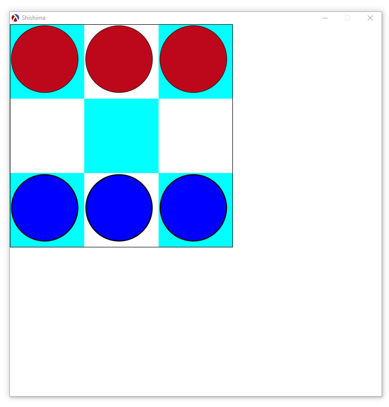
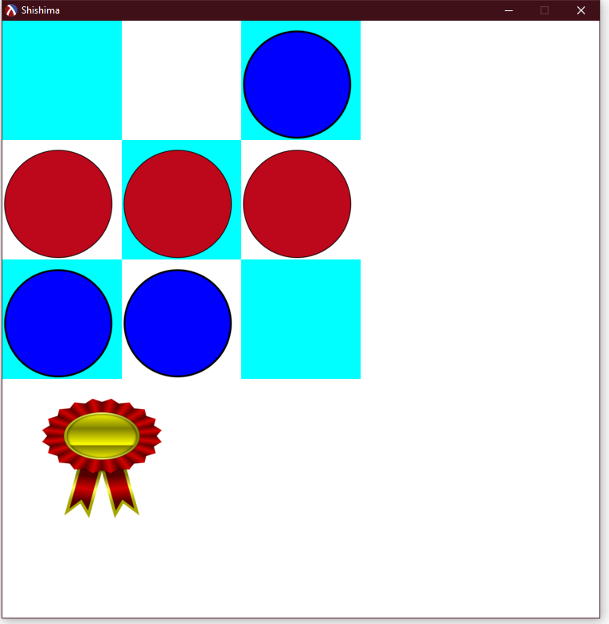

# Shishima Game in Racket

## Overview

This project is a simulation of the traditional African game Shishima, implemented in Racket. The game is similar to tic-tac-toe but with a different board structure. My implementation uses a 3x3 grid instead of the traditional board.


## Table of Contents

- [Overview](#overview)
- [Features](#features)
- [Installation](#installation)
- [Usage](#usage)
- [Gameplay](#gameplay)
- [Contributing](#contributing)
- [License](#license)

## Features

- Two-player gameplay
- Simple and intuitive UI
- Game status display (win)

## Installation

To run this project, you need to have Racket installed on your machine. You can download and install Racket from [here](https://racket-lang.org/).

1. Clone the repository:
   ```bash
   git clone https://github.com/Angello20/ShishimaGame.git
   ```

2. Navigate to the project directory:
   ```bash
   cd ShishimaGame
   ```

## Usage

Open the `shishima.rkt` file in DrRacket or your preferred Racket environment and run the program.

## Gameplay

### Objective

The objective of Shishima is to align three of your pieces in a continuous line (horizontal, vertical, or diagonal).

### Rules

1. **Movement Phase**: Pieces start placed, players take turns moving their pieces to adjacent empty spots.
2. **Winning**: The first player to align their three pieces in a row wins the game.

### Screenshots

Here are some screenshots showing the game in action:




